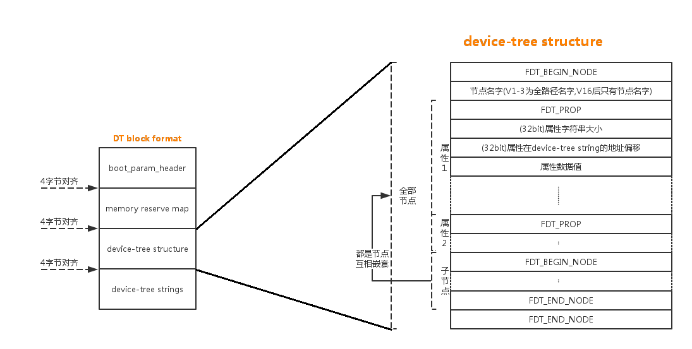

### device_node

```C
struct device_node {
	const char *name;/*如果改node存在name属性，该指针指向其内容，否则设置为"<NULL>"*/
   
	phandle phandle; /*ID句柄*/
	const char *full_name; /*节点的名字*/
	struct fwnode_handle fwnode;    /*fwnode的ops*/

	struct	property *properties;/*node的属性列表*/
	struct	property *deadprops;	/* removed properties */
	struct	device_node *parent;/*父node*/
	struct	device_node *child;/*子node*/
	struct	device_node *sibling;/*兄弟node*/
#if defined(CONFIG_OF_KOBJ)
	struct	kobject kobj;
#endif
	unsigned long _flags;
	void	*data;
#if defined(CONFIG_SPARC)
	unsigned int unique_id;
	struct of_irq_controller *irq_trans;
#endif
};
```

### property

```C
struct property {
	char	*name;
	int	    length;
	void	*value;
	struct property *next;
#if defined(CONFIG_OF_DYNAMIC) || defined(CONFIG_SPARC)
	unsigned long _flags;
#endif
#if defined(CONFIG_OF_PROMTREE)
	unsigned int unique_id;
#endif
#if defined(CONFIG_OF_KOBJ)
	struct bin_attribute attr;
#endif
};
```

### fdt_node_header(dtb中的node)

```C
struct fdt_node_header {
        fdt32_t tag;
        char name[0];
};
```

### fdt_property(dtb中的property)

```C
struct fdt_property {
        fdt32_t tag;
        fdt32_t len;
        fdt32_t nameoff;
        char data[0];
};
```

### TAG

```C
#define FDT_BEGIN_NODE	0x1		/* Start node: full name */
#define FDT_END_NODE	0x2		/* End node */
#define FDT_PROP	    0x3		/* Property: name off,size,content */  
#define FDT_NOP		    0x4		/* nop */
#define FDT_END		    0x9     /*整个structure block的结束*/
```

### unflatten_device_tree

```C
/**
 * unflatten_device_tree - create tree of device_nodes from flat blob
 * 将flat的dtb转换成有依赖关系的设备树
 * unflattens the device-tree passed by the firmware, creating the
 * tree of struct device_node. It also fills the "name" and "type"
 * pointers of the nodes so the normal device-tree walking functions
 * can be used.
 */
void __init unflatten_device_tree(void)
{
	__unflatten_device_tree(initial_boot_params, NULL, &of_root,
				early_init_dt_alloc_memory_arch, false);

	/* Get pointer to "/chosen" and "/aliases" nodes for use everywhere */
	of_alias_scan(early_init_dt_alloc_memory_arch);

	unittest_unflatten_overlay_base();
}
```

### __unflatten_device_tree

```C
/**
 * __unflatten_device_tree - create tree of device_nodes from flat blob
 * 根据dtb生成嵌套的device_nodes节点
 * unflattens a device-tree, creating the
 * tree of struct device_node. It also fills the "name" and "type"
 * pointers of the nodes so the normal device-tree walking functions
 * can be used.
 * @blob: The blob to expand
 * @dad: Parent device node
 * @mynodes: The device_node tree created by the call
 * @dt_alloc: An allocator that provides a virtual address to memory
 * for the resulting tree
 * @detached: if true set OF_DETACHED on @mynodes
 *
 * Returns NULL on failure or the memory chunk containing the unflattened
 * device tree on success.
 */
void *__unflatten_device_tree(const void *blob,
			      struct device_node *dad,
			      struct device_node **mynodes,
			      void *(*dt_alloc)(u64 size, u64 align),
			      bool detached)
{
	int size;
	void *mem;

	pr_debug(" -> unflatten_device_tree()\n");

	if (!blob) {
		pr_debug("No device tree pointer\n");
		return NULL;
	}

	pr_debug("Unflattening device tree:\n");
	pr_debug("magic: %08x\n", fdt_magic(blob));
	pr_debug("size: %08x\n", fdt_totalsize(blob));
	pr_debug("version: %08x\n", fdt_version(blob));

	if (fdt_check_header(blob)) { /*magic.size,bounds检查*/
		pr_err("Invalid device tree blob header\n");
		return NULL;
	}

	/* First pass, scan for size */
    /*
     * 第一遍扫描，计算dtb的structure block数量和其名字长度大小，总内存大小
     * 由此可知，device_node后面紧接着node的字符串名字
     */
	size = unflatten_dt_nodes(blob, NULL, dad, NULL);
	if (size < 0)
		return NULL;
    
    /*
     * #define ALIGN(x, a)           __ALIGN_KERNEL((x), (a))
     * #define __ALIGN_KERNEL(x, a)  __ALIGN_KERNEL_MASK(x, (typeof(x))(a) - 1)
     * #define __ALIGN_KERNEL_MASK(x, mask)  (((x) + (mask)) & ~(mask))
     * 字节对齐，如不足则补全
     */
	size = ALIGN(size, 4);
	pr_debug("  size is %d, allocating...\n", size);

	/* Allocate memory for the expanded device tree */
    /*分配所需的内存，其中4是magic的大小，放在最后，其中需对齐的大小为struct device_node*/
	mem = dt_alloc(size + 4, __alignof__(struct device_node));
	if (!mem)
		return NULL;
    
    /*清0*/
	memset(mem, 0, size);
    /*最后的4字节用作magic，进行大小端转换并保存*/
	*(__be32 *)(mem + size) = cpu_to_be32(0xdeadbeef);

	pr_debug("  unflattening %p...\n", mem);

	/* Second pass, do actual unflattening */
    /*传入已经申请的mem，进行设备树的展开*/
	unflatten_dt_nodes(blob, mem, dad, mynodes);
	if (be32_to_cpup(mem + size) != 0xdeadbeef)/*检查magic是否被写覆盖*/
		pr_warn("End of tree marker overwritten: %08x\n",
			be32_to_cpup(mem + size));

	if (detached && mynodes) {/*传入了false，不进行追踪*/
		of_node_set_flag(*mynodes, OF_DETACHED);
		pr_debug("unflattened tree is detached\n");
	}

	pr_debug(" <- unflatten_device_tree()\n");
	return mem;
}
```

### unflatten_dt_nodes

```C
/**
 * unflatten_dt_nodes - Alloc and populate a device_node from the flat tree
 * 
 * @blob: The parent device tree blob
 * @mem: Memory chunk to use for allocating device nodes and properties
 * @dad: Parent struct device_node
 * @nodepp: The device_node tree created by the call
 *
 * It returns the size of unflattened device tree or error code
 */
/* 第一次: unflatten_dt_nodes(blob, NULL, NULL, NULL); */
/* 第二次: unflatten_dt_nodes(blob, mem, NULL, &of_root); */
static int unflatten_dt_nodes(const void *blob,
			      void *mem,
			      struct device_node *dad,
			      struct device_node **nodepp)
{
	struct device_node *root;
	int offset = 0, depth = 0, initial_depth = 0;
#define FDT_MAX_DEPTH	64 /*每个节点的子节点，最深64个*/
	struct device_node *nps[FDT_MAX_DEPTH];
	void *base = mem;
	bool dryrun = !base;

	if (nodepp)
		*nodepp = NULL;

	/*
	 * We're unflattening device sub-tree if @dad is valid. There are
	 * possibly multiple nodes in the first level of depth. We need
	 * set @depth to 1 to make fdt_next_node() happy as it bails
	 * immediately when negative @depth is found. Otherwise, the device
	 * nodes except the first one won't be unflattened successfully.
	 */
	if (dad)
		depth = initial_depth = 1;

	root = dad;
	nps[depth] = dad;

 
	for (offset = 0;
	     offset >= 0 && depth >= initial_depth;/*当遍历完所有node后，depth为0，退出循环*/
	     offset = fdt_next_node(blob, offset, &depth)) {
		if (WARN_ON_ONCE(depth >= FDT_MAX_DEPTH))
			continue;

		if (!IS_ENABLED(CONFIG_OF_KOBJ) && /*为ture，不成立*/
		    !of_fdt_device_is_available(blob, offset))
			continue;
        
        /*
         * 计算每一个device_node+该node的名字长度
         * 如dryrun为0，则会对mem的device_node和name进行初始化
         * 否则，只进行内存大小的统计
         */
		if (!populate_node(blob, offset, &mem, nps[depth],
				   &nps[depth+1], dryrun))
			return mem - base;

        /*
         * 第二次，传入的nodepp为of_root
         * 此时of_root为空，将初始化的第一个device_node
         * 赋予给of_root作为起始节点
         */
		if (!dryrun && nodepp && !*nodepp)
			*nodepp = nps[depth+1];
		if (!dryrun && !root)
			root = nps[depth+1];
	}

	if (offset < 0 && offset != -FDT_ERR_NOTFOUND) {
		pr_err("Error %d processing FDT\n", offset);
		return -EINVAL;
	}

	/*
	 * Reverse the child list. Some drivers assumes node order matches .dts
	 * node order
	 */
	if (!dryrun) /*反转链表，意义在哪*/
		reverse_nodes(root);

	return mem - base;
}
```


### populate_node

```C
static bool populate_node(const void *blob,
			  int offset,
			  void **mem,
			  struct device_node *dad,
			  struct device_node **pnp,
			  bool dryrun)
{
	struct device_node *np;
	const char *pathp;
	unsigned int l, allocl;
    /*获取到offset偏移的节点的名字，并返回其字符串长度l*/
	pathp = fdt_get_name(blob, offset, &l);
	if (!pathp) {
		*pnp = NULL;
		return false;/*已经遍历完成*/
	}

	allocl = ++l; /*加上'\0'*/

    /*
     * unflatten_dt_alloc只是做了所需申请内存统计，并没有真的申请
     * mem是二级指针，mem实际就是size，累计内存大小
     * size = sizeof(struct device_node) + allocl;
     * np = mem;
     * mem += size;
     */
	np = unflatten_dt_alloc(mem, sizeof(struct device_node) + allocl,
				__alignof__(struct device_node));
    
    
    /*
     * 根据上个调用的函数unflatten_dt_nodes
     * 第二次时，已经申请了mem，此时np则会持续往下，定位到每个node
     * 对每个node进行结构内容进行初始化
     */    
	if (!dryrun) { /*顾名思义，!dryrun，则需要做实际操作*/
		char *fn;
		of_node_init(np);/*设置通用ops，ktype*/
        
        /* 
         * 申请的内存，数据放置格式为 ：device_node在前，string在后
         * 长度为 n*（device_node + string）
         * full_name 指向 string 的位置
         */
		np->full_name = fn = ((char *)np) + sizeof(*np);
        
		memcpy(fn, pathp, l);/*并复制node的名字到string位置*/

		if (dad != NULL) { /*记录兄弟，父，子*/
			np->parent = dad;
			np->sibling = dad->child;
			dad->child = np;
		}
	}

	populate_properties(blob, offset, mem, np, pathp, dryrun);
	if (!dryrun) {
        /*找到name属性内容，赋给property->name*/
		np->name = of_get_property(np, "name", NULL);
		if (!np->name)
			np->name = "<NULL>"; /*找不到name属性，property->name设置为<NULL>*/
	}

	*pnp = np;/*返回刚刚初始化完成的device_node*/
	return true; /*只要节点没遍历完，就会一直返回ture*/
}
```

### fdt_get_name

```C
const char *fdt_get_name(const void *fdt, int nodeoffset, int *len)
{
    /*第nodeoffset个偏移的structure block内容指针*/
	const struct fdt_node_header *nh = fdt_offset_ptr_(fdt, nodeoffset);
	const char *nameptr;
	int err;

	if (((err = fdt_ro_probe_(fdt)) < 0)
	    || ((err = fdt_check_node_offset_(fdt, nodeoffset)) < 0))
			goto fail;

	nameptr = nh->name;
    /*旧版本命名前缀带有'/'*/
	if (!can_assume(LATEST) && fdt_version(fdt) < 0x10) {
		/*
		 * For old FDT versions, match the naming conventions of V16:
		 * give only the leaf name (after all /). The actual tree
		 * contents are loosely checked.
		 */
		const char *leaf;
		leaf = strrchr(nameptr, '/');/*找到最后一次出现'/'的地方*/
		if (leaf == NULL) {
			err = -FDT_ERR_BADSTRUCTURE;
			goto fail;
		}
		nameptr = leaf+1;  /*偏移1*/
	}

	if (len)
		*len = strlen(nameptr); /*名字最后带'/0'，可以计算出长度*/

	return nameptr;

 fail:
	if (len)
		*len = err;
	return NULL;
}
```


### unflatten_dt_alloc

```C
static void *unflatten_dt_alloc(void **mem, unsigned long size,
				       unsigned long align)
{
	void *res;

	*mem = PTR_ALIGN(*mem, align);
	res = *mem; /*改变前先保存*/
	*mem += size; /*累加*/

	return res;
}
```


### fdt_next_node

```C
/*获得下一个 structure block 的节点*/
int fdt_next_node(const void *fdt, int offset, int *depth)
{
	int nextoffset = 0;
	uint32_t tag;
    
    /*
     * 不是FDT_BEGIN_NODE，直接返回，说明传入的offset不是node
     */
	if (offset >= 0)
		if ((nextoffset = fdt_check_node_offset_(fdt, offset)) < 0)
			return nextoffset; 

	do {
        /*
         * 当node的tag为FDT_BEGIN_NODE，此时已越过一个tag
         */
		offset = nextoffset;
		tag = fdt_next_tag(fdt, offset, &nextoffset);/*获取下一个tag*/

		switch (tag) {
		case FDT_PROP:/*越过属性FDT_PROP和空FDT_NOP*/
		case FDT_NOP:
			break;

		case FDT_BEGIN_NODE:
			if (depth) 
				(*depth)++;/*找到子节点的FDT_BEGIN_NODE，深度+1，循环结束，返回子节点*/
			break;

		case FDT_END_NODE: 
            /*
             * 深度-1，因为起始深度为0，如此时不为0，说明嵌套于子节点中，继续遍历寻找
             * 否则说明，该root节点的子节点都已经遍历结束
             */
			if (depth && ((--(*depth)) < 0))
				return nextoffset; 
			break;

		case FDT_END:/*整个structure block 结束*/
			if ((nextoffset >= 0)
			    || ((nextoffset == -FDT_ERR_TRUNCATED) && !depth))
				return -FDT_ERR_NOTFOUND;
			else
				return nextoffset;
		}
	} while (tag != FDT_BEGIN_NODE); /*当前node的下一个子node*/

	return offset;
}
```

### fdt_check_node_offset_

```C
int fdt_check_node_offset_(const void *fdt, int offset)
{
	if (!can_assume(VALID_INPUT)
	    && ((offset < 0) || (offset % FDT_TAGSIZE)))
		return -FDT_ERR_BADOFFSET;

	if (fdt_next_tag(fdt, offset, &offset) != FDT_BEGIN_NODE) /*符合FDT_BEGIN_NODE*/
		return -FDT_ERR_BADOFFSET;

	return offset;/*返回了下一个node*/
}
```

### fdt_next_tag

```C
/*
 * return：返回tag类型
 */
uint32_t fdt_next_tag(const void *fdt, int startoffset, int *nextoffset)
{
	const fdt32_t *tagp, *lenp;
	uint32_t tag;
	int offset = startoffset;
	const char *p;

	*nextoffset = -FDT_ERR_TRUNCATED;
    /*
     * 找到第n个structure，第三个参数传入作用是，检查大小为FDT_TAGSIZE，是否会读写越界
     * 此时tagp指向的就是tag，可以直接读
     */
	tagp = fdt_offset_ptr(fdt, offset, FDT_TAGSIZE);
    
    
	if (!can_assume(VALID_DTB) && !tagp) /*到了末尾*/
		return FDT_END; /* premature end */
    
    /*转大小端*/
	tag = fdt32_to_cpu(*tagp);
    
    /*偏移fdt32_t大小*/
	offset += FDT_TAGSIZE;

	*nextoffset = -FDT_ERR_BADSTRUCTURE;
	switch (tag) {
	case FDT_BEGIN_NODE:/*node头*/
		/* skip name */
		do {
			p = fdt_offset_ptr(fdt, offset++, 1); /*offset++，意味着会越过'/0'*/    
		} while (p && (*p != '\0'));
		if (!can_assume(VALID_DTB) && !p) /*到了末尾*/
			return FDT_END; /* premature end */
		break;

	case FDT_PROP:/*属性*/
        /*找到对应要处理的structure首地址，并越界检查*/
		lenp = fdt_offset_ptr(fdt, offset, sizeof(*lenp));
		if (!can_assume(VALID_DTB) && !lenp)
			return FDT_END; /* premature end */
            
		/* skip-name offset, length and value */
            
        /*
         * 因上面+FDT_TAGSIZE，所以要减回去
         * *lenp：属性字符串的大小
         * fdt_property->name[0] 不占空间
         */    
		offset += sizeof(struct fdt_property) - FDT_TAGSIZE
			+ fdt32_to_cpu(*lenp);
            
		if (!can_assume(LATEST) &&
		    fdt_version(fdt) < 0x10 && fdt32_to_cpu(*lenp) >= 8 &&
		    ((offset - fdt32_to_cpu(*lenp)) % 8) != 0)
			offset += 4; /*不清楚什么意思，但是最后呈现的*/
		break;

	case FDT_END:
	case FDT_END_NODE:
	case FDT_NOP:
		break;

	default:
		return FDT_END;
	}
    /*检查*/
	if (!fdt_offset_ptr(fdt, startoffset, offset - startoffset))
		return FDT_END; /* premature end */

    /*
     * 每个node的长度可能不是对齐的，需要align补全
     * nextoffset保存了下一个node的开始，即tag type
     */
	*nextoffset = FDT_TAGALIGN(offset);
	return tag; /*返回node tag类型*/
}
```

### fdt_offset_ptr

```C
/*这个函数只是做了一些保护检查，真正执行处理的是 fdt_offset_ptr_ */
const void *fdt_offset_ptr(const void *fdt, int offset, unsigned int len)
{
	unsigned int uoffset = offset;
    /*找到dtb的strucure位置，并偏移offset*/
	unsigned int absoffset = offset + fdt_off_dt_struct(fdt);

	if (offset < 0)
		return NULL;

	if (!can_assume(VALID_INPUT))
		if ((absoffset < uoffset) /*溢出*/
		    || ((absoffset + len) < absoffset) /*溢出*/
		    || (absoffset + len) > fdt_totalsize(fdt))/*越界*/
			return NULL;

	if (can_assume(LATEST) || fdt_version(fdt) >= 0x11)
		if (((uoffset + len) < uoffset) /*溢出*/
		    || ((offset + len) > fdt_size_dt_struct(fdt)))
			return NULL;

	return fdt_offset_ptr_(fdt, offset);
}
```

### fdt_offset_ptr_

```C
/*structure block的大小*/
#define fdt_off_dt_struct(fdt)          (fdt_get_header(fdt, off_dt_struct))

static inline const void *fdt_offset_ptr_(const void *fdt, int offset)
{
   return (const char *)fdt + fdt_off_dt_struct(fdt) + offset;
   /*找到第一个structure的位置，offset为偏移值，可以偏移多个structure block，也可以偏移成员位置*/
}
```

### of_node_init

```C
static inline void of_node_init(struct device_node *node)
{
#if defined(CONFIG_OF_KOBJ)
	kobject_init(&node->kobj, &of_node_ktype); /*设置ktype为of_node_ktype*/
#endif
	node->fwnode.ops = &of_fwnode_ops; /*设置ops为of_fwnode_ops*/
}
```

### of_fwnode_ops

```C
const struct fwnode_operations of_fwnode_ops = {
	.get = of_fwnode_get,
	.put = of_fwnode_put,
	.device_is_available = of_fwnode_device_is_available,
	.device_get_match_data = of_fwnode_device_get_match_data,
	.property_present = of_fwnode_property_present,
	.property_read_int_array = of_fwnode_property_read_int_array,
	.property_read_string_array = of_fwnode_property_read_string_array,
	.get_name = of_fwnode_get_name,
	.get_name_prefix = of_fwnode_get_name_prefix,
	.get_parent = of_fwnode_get_parent,
	.get_next_child_node = of_fwnode_get_next_child_node,
	.get_named_child_node = of_fwnode_get_named_child_node,
	.get_reference_args = of_fwnode_get_reference_args,
	.graph_get_next_endpoint = of_fwnode_graph_get_next_endpoint,
	.graph_get_remote_endpoint = of_fwnode_graph_get_remote_endpoint,
	.graph_get_port_parent = of_fwnode_graph_get_port_parent,
	.graph_parse_endpoint = of_fwnode_graph_parse_endpoint,
	.add_links = of_fwnode_add_links,
};
```

### of_node_ktype

```C
struct kobj_type of_node_ktype = {
        .release = of_node_release,
};
```


### of_get_property

```C
/*
 * Find a property with a given name for a given node
 * and return the value.
 */
const void *of_get_property(const struct device_node *np, const char *name,
                            int *lenp)
{
        struct property *pp = of_find_property(np, name, lenp);

        return pp ? pp->value : NULL;
}
```

### of_find_property

```C
struct property *of_find_property(const struct device_node *np,
				  const char *name,
				  int *lenp)
{
	struct property *pp;
	unsigned long flags;

	raw_spin_lock_irqsave(&devtree_lock, flags);
	pp = __of_find_property(np, name, lenp);
	raw_spin_unlock_irqrestore(&devtree_lock, flags);

	return pp;
}
```

### __of_find_property

```C
static struct property *__of_find_property(const struct device_node *np,
					   const char *name, int *lenp)
{
	struct property *pp;

	if (!np)
		return NULL;
    /*遍历device_node->properties链表的属性，找到同名*/
	for (pp = np->properties; pp; pp = pp->next) {
		if (of_prop_cmp(pp->name, name) == 0) {
			if (lenp)
				*lenp = pp->length; /*返回其长度*/
			break;
		}
	}

	return pp;
}
```

### strcasecmp

```C
/*of_prop_cmp 底层调用的就是 strcasecmp*/
int strcasecmp(const char *s1, const char *s2)
{
        int c1, c2;

        do {
                c1 = tolower(*s1++);/*转换小写*/
                c2 = tolower(*s2++);
        } while (c1 == c2 && c1 != 0);
        return c1 - c2;
}
```
### populate_properties

```C
static void populate_properties(const void *blob,
				int offset,
				void **mem,
				struct device_node *np,
				const char *nodename,
				bool dryrun)
{
	struct property *pp, **pprev = NULL;
	int cur;
	bool has_name = false;

	pprev = &np->properties;
               /*遍历获取node的属性*/
	for (cur = fdt_first_property_offset(blob, offset);
	     cur >= 0;
	     cur = fdt_next_property_offset(blob, cur)) {
               /*当到遍历完所有属性后，返回负值，则退出循环*/
		const __be32 *val;
		const char *pname;
		u32 sz;
        /*找到nameoff位置的字符串，并返回其长度*/
		val = fdt_getprop_by_offset(blob, cur, &pname, &sz);
		if (!val) {
			pr_warn("Cannot locate property at 0x%x\n", cur);
			continue;
		}

		if (!pname) {
			pr_warn("Cannot find property name at 0x%x\n", cur);
			continue;
		}

		if (!strcmp(pname, "name"))/*存在name属性*/
			has_name = true;
        /*累计mem，即统计device_node的所需同时，也统计property*/
		pp = unflatten_dt_alloc(mem, sizeof(struct property),
					__alignof__(struct property));
		if (dryrun)/*只统计property所需内存大小，不进行处理*/
			continue;

		/* We accept flattened tree phandles either in
		 * ePAPR-style "phandle" properties, or the
		 * legacy "linux,phandle" properties.  If both
		 * appear and have different values, things
		 * will get weird. Don't do that.
		 */
		if (!strcmp(pname, "phandle") || /*如果出现phandle属性，则会赋值给property->phandle*/
		    !strcmp(pname, "linux,phandle")) {
			if (!np->phandle)
				np->phandle = be32_to_cpup(val);
		}

		/* And we process the "ibm,phandle" property
		 * used in pSeries dynamic device tree
		 * stuff
		 */
		if (!strcmp(pname, "ibm,phandle"))
			np->phandle = be32_to_cpup(val);

		pp->name   = (char *)pname; /*记录属性名*/
		pp->length = sz; /*属性内容长度*/
		pp->value  = (__be32 *)val; /*属性内容*/
		*pprev     = pp;
		pprev      = &pp->next;
	}

	/* With version 0x10 we may not have the name property,
	 * recreate it here from the unit name if absent
	 */
	if (!has_name) { /*自行补全 phandle属性*/
		const char *p = nodename, *ps = p, *pa = NULL;
		int len;

		while (*p) {
			if ((*p) == '@')
				pa = p;
			else if ((*p) == '/')
				ps = p + 1;
			p++;
		}

		if (pa < ps)
			pa = p;
		len = (pa - ps) + 1;
        /*记录phandle属性所需大小*/
		pp = unflatten_dt_alloc(mem, sizeof(struct property) + len,
					__alignof__(struct property));
		if (!dryrun) {
			pp->name   = "name";
			pp->length = len;
			pp->value  = pp + 1;
			*pprev     = pp;
			pprev      = &pp->next;
			memcpy(pp->value, ps, len - 1);
			((char *)pp->value)[len - 1] = 0;
			pr_debug("fixed up name for %s -> %s\n",
				 nodename, (char *)pp->value);
		}
	}

	if (!dryrun)
		*pprev = NULL;
}
```

### fdt_first_property_offset

```C
int fdt_first_property_offset(const void *fdt, int nodeoffset)
{
	int offset;
    /*先确认当前node是否符合FDT_BEGIN_NODE,不符合，返回错误码*/
	if ((offset = fdt_check_node_offset_(fdt, nodeoffset)) < 0)
		return offset;
    /*符合，寻找其node的属性的FDT_PROP*/
	return nextprop_(fdt, offset);
}
```

### nextprop_

```C
static int nextprop_(const void *fdt, int offset)
{
	uint32_t tag;
	int nextoffset;

	do {
		tag = fdt_next_tag(fdt, offset, &nextoffset);

		switch (tag) {
		case FDT_END:
			if (nextoffset >= 0)
				return -FDT_ERR_BADSTRUCTURE;
			else
				return nextoffset;

		case FDT_PROP:/*找到属性的标签，返回其地址偏移*/
			return offset;
		}
		offset = nextoffset;
	} while (tag == FDT_NOP);/*当找到FDT_NOP，跳过，继续往下找*/

	return -FDT_ERR_NOTFOUND;
}
```

### fdt_next_property_offset

```C
int fdt_next_property_offset(const void *fdt, int offset)
{
	if ((offset = fdt_check_prop_offset_(fdt, offset)) < 0)
		return offset;

	return nextprop_(fdt, offset);
}
```

### fdt_check_prop_offset_

```C
int fdt_check_prop_offset_(const void *fdt, int offset)
{
	if (!can_assume(VALID_INPUT)
	    && ((offset < 0) || (offset % FDT_TAGSIZE)))
		return -FDT_ERR_BADOFFSET;

	if (fdt_next_tag(fdt, offset, &offset) != FDT_PROP)
		return -FDT_ERR_BADOFFSET;

	return offset;
}
```

### fdt_getprop_by_offset

```C
const void *fdt_getprop_by_offset(const void *fdt, int offset,
				  const char **namep, int *lenp)
{
	const struct fdt_property *prop;

	prop = fdt_get_property_by_offset_(fdt, offset, lenp);
	if (!prop)
		return NULL;
	if (namep) {
		const char *name;
		int namelen;

		if (!can_assume(VALID_INPUT)) {
			name = fdt_get_string(fdt, fdt32_ld(&prop->nameoff),
					      &namelen);
			if (!name) {
				if (lenp)
					*lenp = namelen;
				return NULL;
			}
			*namep = name;
		} else {
			*namep = fdt_string(fdt, fdt32_ld(&prop->nameoff));
		}
	}

	/* Handle realignment */
	if (!can_assume(LATEST) && fdt_version(fdt) < 0x10 &&
	    (offset + sizeof(*prop)) % 8 && fdt32_ld(&prop->len) >= 8)
		return prop->data + 4; 
	return prop->data;/*返回data[0],即内容*/
}
```

### fdt_get_property_by_offset_

```C
static const struct fdt_property *fdt_get_property_by_offset_(const void *fdt,
						              int offset,
						              int *lenp)
{
	int err;
	const struct fdt_property *prop;

	if (!can_assume(VALID_INPUT) &&
	    (err = fdt_check_prop_offset_(fdt, offset)) < 0) {
		if (lenp)
			*lenp = err;
		return NULL;
	}

	prop = fdt_offset_ptr_(fdt, offset);

	if (lenp)
		*lenp = fdt32_ld(&prop->len);/*反回其内容的长度*/

	return prop;/*检查无误后，返回fdt_property结构体的首地址*/
}
```


## 总结

****

1. 将dtb进行展开成device_node，在structure block开始寻找
2. 根据FDT_BEGIN_NODE来寻找有多少节点，统计需要生成的struct device_node数量
3. 根据节点的名字（字符串大小）来统计所需的字节长度
4. 根据每个节点内的FDT_PROP，统计需要生成的struct property数量
5. 统计自动生成的phandle属性的名字和内容大小
6. 还有4字节大小的magic数，在内存的最后位置。
7. 统计的总需内存大小，生成一大块内存。
8. 重新遍历一次，根据申请的内存，把所有的node和其property指向它，并进行初始化，并对node的父子兄弟关系进行关联
9. 留意，node会创建long_name的字符串内存，property的name，val并不会新创建，而是直接指向dtb对应的位置。
10. 填充magic

