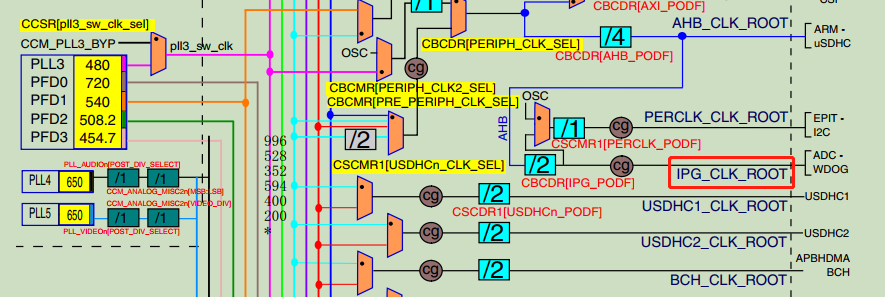

### UART时钟源
|name|root|description|
|--------|-----|--------------|
|ipg_clk|ipg_clk_root|如下图所示|
|ipg_clk_s|ipg_clk_root|如下图所示|
|ipg_perclk|uart_clk_root|模块时钟|

### 时钟图

### 时钟类型

- peripheral_clock：

- module_clock:用于状态机，写RxFIFO，读TxFIFO等

### 波特率

- 最大波特率：取决于module_clock，如module_clock=66.5MHz，最大波特率为66.5M / 16 = 4.15Mbit/s
- 波特率 = Ref Freq / ( 16 * (UBMR +1) / (UBIR +1) )
- Ref Freq：module_clock after RFDIV divider
- UBMR：寄存器
- UBIR：寄存器